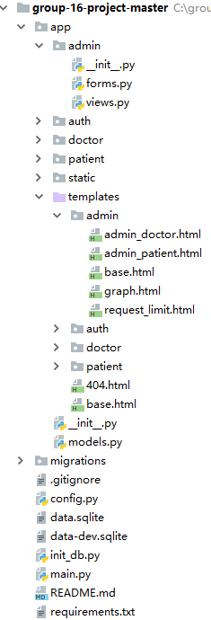

Vaccination Booking System  
    

======

## Table of Contents
- [Background](#background)   
- [Introduction](#introduction)  
- [Framework](#framework)  
- [Environment_Configuration](#environment_Configuration)  
- [User_Instructions](#user_Instructions)  
- [Developers](#developers)  

<h2 id = "background">Background</h2>
The COVID-19 pandemic threaten public health and security. In order to deal with this serious global crisis. People are recommended to be vaccinated. Our group find the phenomenon in our campus that the organization of vaccination faces serious challenges.  
    
In order to help students and teachers receive vaccination in order and improve the efficiency of doctor's job. Our group decided to create this vaccination booking system.  

<h2 id = "introduction">Introduction</h2>
Vaccination Booking System is a web page which helps people to get the Covid-19 vaccine easily and assist doctors to manage patients' information.  
    
After registering, the user can log in our website to filter different vaccination stations and make an appointment for vaccination. The user can also use the website's map function to find their way to the vaccination station. Firstly, the patient should edit her/his profile to accomplish the information. Then, the patient can view all the available clinics and view them. We design a sub-menu to check all the appointments for one clinic, please click the "view" to check it. If the patient has decided, he/she can click the "booking" to send a request to the clinic and wait for response in the "message" section. We have also designed a "status" and "profile" to visualize the procedure of the booking request.  
    
After registering, the doctor can set information for the clinic in "clinic-info" (like the profile in patient page). They can create and delete vaccination event using this platform. The start time and end time can be set with the assist of time selector. After some patients sending their requests, the doctors can log in the website to check how many & when people will come for vaccination. They can approve or reject the request. If a request is approved, the doctor can accomplish this vaccination and the related patient will receive the message.  
    
After registering, the administrators can edit several informations of patients and clinics. They can also set the booking request limits for each patient, avoiding frequent annoying to the clinics. A statistic pie is also supported. 
     
Noteworthy, we have already set an account in the database for the administrator. The account is "c@qq.com" and the password is "c".    
    
<h2 id = "framework">Framework</h2>
The project consists of front-end part and back-end part.  
    
The front-end part consists of a series of web pages serving as an information platform. For this part, we decide to use techniques related to html/css/javascript/bootstrap to generate it.  
    
The back-end part consists of a database storing information of patients, clinics, administrators, records, and appointments and functions to execute redirecting, searching and other operations. For this part, we decide to use python with flask and sqlite to realize it.  
    
Here we display the project structure in a simple way.  

<h2 id = "environment_Configuration">Environment_Configuration</h2>
- Browser (like [Chrome](https://www.google.cn/chrome/index.html), [Firefox](https://www.firefox.com.cn/), [Edge](https://www.microsoft.com/zh-cn/edge)) is needed;  
- The user needs to install relative packages with proper versions. There is a "requirements.text" to help you do that. 
- Entering into the terminal where supports commands "pip", using "pip install -r requirements.txt" to install.  
- After package installation, edit the configuration to use python to run the "main.py"(We develop with Python3.7).  
- If the "main.py" runs properly, there should be a localhost link that you can surf it in your Browser.  

<h2 id = "user_Instructions">User_Instructions</h2>
1.  New users need to register first. Click the login button -> click the Register Button  
    
2.  There are three kinds of accounts - inoculator, doctor an administrator. The visitor can choose the right kind of account according to their identity.  
    
3.  As for inoculator(we call it patient), they can select the vaccination station and the time to get vaccination. The inoculator can find how to get to the vaccination station using built-in map  
on the website. Inoculators can use the message function to contact the doctors(clinics).  
    
4.  As for doctor, the doctor can deliver the time & location of vaccination. The doctor can also check the number of people registering for individual vaccination request. For each request the doctor can approve or reject it. If the request is approved, the doctor can accomplish the vaccination of this patient. Doctors can use the message function to contact the patients.  
    
5.  As for administrator, the administrator has the right to make changes to the information of patients and doctors. The administrator can also set the booking request limit for each patient, which prevents frequent annoying. Eventually, there supports a statistic pie chart to display the vaccination proportion of all the patients.  
    

<h2 id = "developers">Developers</h2>
19206210 Li Sixu  
19206211 Luo Ruize  
19206212 Wang Yuchen  
19206214 Ren Tianli  
19206224 Zhang Zhuoyi  

